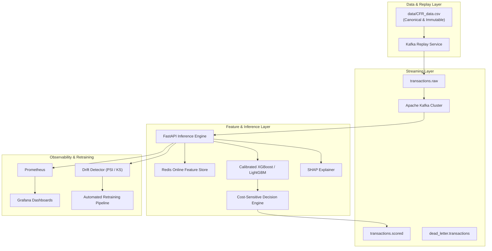

# Real-Time Financial Fraud Detection & Risk Scoring Platform

Production-grade, end-to-end Financial Fraud Detection & Risk Scoring Platform featuring real-time event processing with Kafka, online feature storage with Redis, probability-calibrated machine learning models (XGBoost/LightGBM), cost-sensitive decision engine (APPROVE/REVIEW/BLOCK), automated retraining, SHAP explainability, and complete observability.

---

## 🏛️ Architecture Overview



---

## 🚀 Key Features

* **Absolute Dataset Policy**: Uses ONLY `data/CFR_data.csv` validated via SHA-256 hash checking.
* **Leakage Prevention**: Strictly isolates post-event target variables (`true_fraud_label`, `fraud_scenario`, `observed_label`, `label_timestamp`).
* **Temporal Validation**: Strictly chronological train/validation/test splits preventing future-data leakage.
* **Fit-Aware Preprocessing**: Preprocessing parameters (categorical frequency maps, scalers) are fit exclusively on training data to avoid val/test distribution leakage.
* **Cost-Sensitive Decision Engine**: Optimizes custom decision thresholds against actual monetary losses and customer friction costs (`APPROVE`, `REVIEW`, `BLOCK`).
* **Probability Calibration**: Calibrates raw model probabilities using Platt scaling and Isotonic regression.
* **SHAP Explainability**: Integrates TreeExplainer for per-transaction risk breakdown and global feature importance.
* **High Performance**: Designed and benchmarked for **p95 latency < 100ms**.

---

## 🛠️ Quick Start

### 1. Prerequisites
Ensure Python 3.10+ is installed.

### 2. Installation
Install core development dependencies:

```bash
pip install -e ".[dev]"
```

For full streaming and infrastructure tools (Kafka, Redis, MLflow, etc.):

```bash
pip install -e ".[dev,infra,viz]"
```

### 3. Dataset Validation
Verify canonical dataset integrity (`data/CFR_data.csv`):

```bash
python -m src.data.dataset_validator
# or using Makefile
make validate-dataset
```

### 4. Run Training Pipeline
Train models, calibrate probabilities, optimize risk thresholds, and export production artifacts:

```bash
python scripts/train.py
# or using Makefile
make train
```

### 5. Run Evaluation & Inference
Evaluate production artifacts on the temporal test set:

```bash
python scripts/evaluate.py
```

Score sample transactions via CLI:

```bash
python scripts/predict.py
```

### 6. Run Latency Benchmark
Verify inference latency against performance targets (p95 < 100ms):

```bash
python scripts/benchmark.py
```

### 7. Launch Stack via Docker Compose
To run API, Kafka, Redis, Prometheus, Grafana, and Replay:

```bash
docker-compose up -d
```

---

## 🧪 Testing Suite

Run the full unit test suite (isolated from the dataset, runs fast in CI):

```bash
pytest tests/ -v -m "not integration"
# or
make test
```

Run dataset integration and integrity tests (requires `data/CFR_data.csv`):

```bash
pytest tests/ -v -m integration
```

Run mandatory data leakage regression tests:

```bash
pytest tests/test_leakage.py
```
